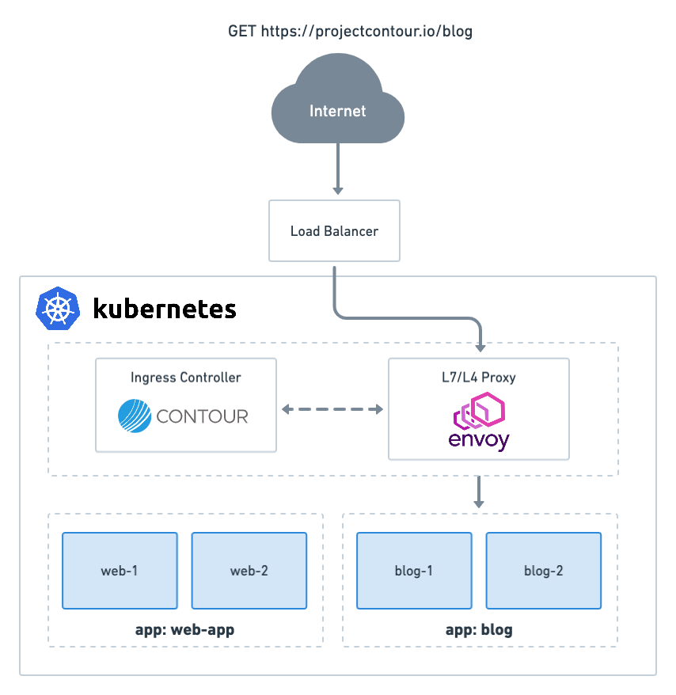

Let's now install cert-manager, and Contour.

##### cert-manager

cert-manager adds **certificates** and **certificate issuers** as resource types in Kubernetes clusters. It also helps you to **obtain, renew, and use those certificates**. 

To add it to our installation, we have to remove the package from the **excluded_packages**.
```editor:select-matching-text
file: tap-values.yml
text: "  - cert-manager.tanzu.vmware.com"
```
```editor:replace-text-selection
file: tap-values.yml
text: ""
```
As you can see in the component documentation here, it's also possible to install the package individually but we are using the profile installation as described in the last section.
```dashboard:open-url
url: {{ ENV_TAP_PRODUCT_DOCS_BASE_URL }}/GUID-cert-mgr-contour-fcd-install-cert-mgr.html#install-certmanager-1
```

##### Contour

One of the most critical needs when running workloads at scale on Kubernetes is **efficient and smooth traffic Ingress management at the application layer**. Getting an application up and running is not the entire story; the app still needs a way for users to access it. The ingress controller Contour was designed to fill this operational gap.

In Kubernetes, **Ingress is a set of routing rules that define how external traffic is routed to an application** inside a Kubernetes cluster. An **Ingress controller** watches for changes to objects in the cluster and then **wires together a data path for each request to be resolved**. An Ingress controller processes the requests for resources, provides transport layer security (TLS) termination, and performs other functions.

Contour acts as a control plane for the Envoy edge and service proxy.
**Envoy** is a Layer 7 (application layer) bus for proxy and communication in modern service-oriented architectures, such as Kubernetes clusters. Envoy strives to make the network transparent to applications while maximizing observability to ease troubleshooting.



To install Contour, we first have to remove the package from the **excluded_packages**.
```editor:select-matching-text
file: tap-values.yml
text: "  - contour.tanzu.vmware.com"
```
```editor:replace-text-selection
file: tap-values.yml
text: ""
```

By default, Envoy will be exposed over a NodePort service. To change the service type to LoadBalancer, we have to add additional configuration to our tap-values.yml.

As for any other package, we can see the available configuration options via
```execute
tanzu package available list contour.tanzu.vmware.com -n tap-install --kubeconfig kubeconfig.yaml
tanzu package available get contour.tanzu.vmware.com/1.18.2+tap.1 --values-schema -n tap-install --kubeconfig kubeconfig.yaml
```

Let's now add the custom configuration at the end of the file ...
```editor:append-lines-to-file
file: tap-values.yml
text: |
  contour:
    envoy:
      service:
        type: LoadBalancer
```
... and install both components via an update to our profile installation.
```terminal:execute
command: tanzu package installed update tap -p tap.tanzu.vmware.com -v 1.0.2 --values-file tap-values.yml -n tap-install --kubeconfig kubeconfig.yaml 
clear: true
```

Execute the following command and wait until the status of the PackageInstalls is **Reconcile Succeeded**.
```terminal:execute
command: tanzu package installed list -n tap-install --kubeconfig kubeconfig.yaml 
clear: true
````

The next step is to **add a A or CNAME record for e.g. "&ast;.tap.example.com" to your DNS registry** of choice depending on whether the external address of Envoy's LoadBalancer service is an IP or a DNS name.
To get the IP/DNS name of Envoy's LoadBalancer service run the following command:
```terminal:execute
command: kubectl get services -n tanzu-system-ingress
clear: true
```

Now that Contour is installed we can validate it is functioning correctly by deploying an application, exposing it as a service, then creating an Ingress resource. 
```execute
kubectl create namespace my-ingress-app
kubectl -n my-ingress-app create deployment --image=nginx nginx
kubectl -n my-ingress-app expose deployment nginx --port 80
kubectl -n my-ingress-app create ingress nginx --rule="nginx.${TAP_INGRESS_DOMAIN}/*=nginx:80"
```

Validate that your resources are deployed and ready...
```terminal:execute
command: kubectl -n my-ingress-app get all,ingress
clear: true
```

```terminal:execute
command: kubectl -n my-ingress-app get ingress nginx -o yaml
clear: true
```

... and that you can access the application.
```terminal:execute
command: curl -s nginx.$TAP_INGRESS_DOMAIN   | grep h1
clear: true
```

As well as **Ingress** Contour supports a resource type **HTTPProxy** which extends the concept of Ingress to add many features that you would normally have to reach for Istio or a similar service mesh to get.

In TAP most of the components use HTTPProxy, which e.g. has the benefit of being able to reference a TLS Kubernetes Secret in a different namespace. Only *Learning Center for Tanzu Application Service* still uses Ingress resources.

To create a HTTPProxy resource for our deployment, run the following command.
```execute
cat << EOF | kubectl apply -f -
apiVersion: projectcontour.io/v1
kind: HTTPProxy
metadata:
  name: nginx
  namespace: my-ingress-app
spec:
  virtualhost:
    fqdn: nginx-http-proxy.$TAP_INGRESS_DOMAIN 
  routes:
    - conditions:
      - prefix: /
      services:
        - name: nginx
          port: 80
EOF
```
After we have validated that the resource is ready ...
```terminal:execute
command: kubectl -n my-ingress-app get httpproxy nginx
clear: true
```

... we can access the application via:
```terminal:execute
command: curl -s nginx-http-proxy.$TAP_INGRESS_DOMAIN  | grep h1
clear: true
```

Examples of more advanced features of HttpProxy are rate limiting, weighted routing, and configration of the load balancing strategy for multiple target services.

Let’s clean up our resources before we move on.
```execute
kubectl delete ns my-ingress-app
````